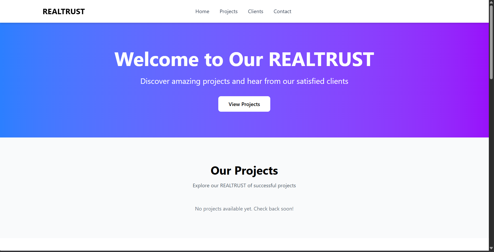
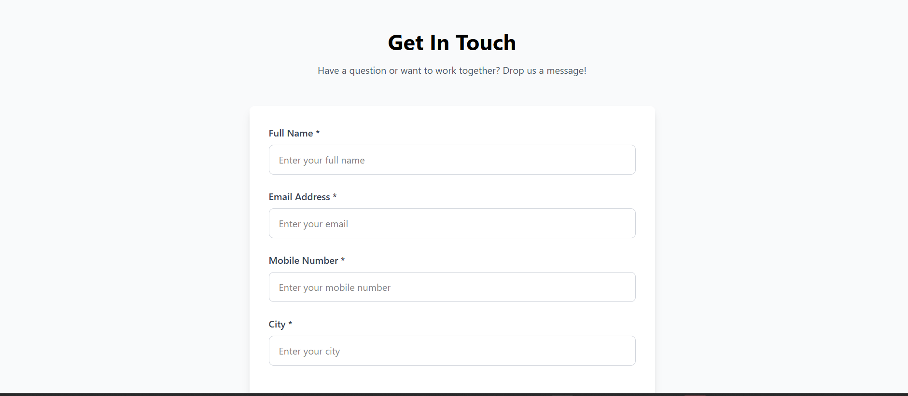
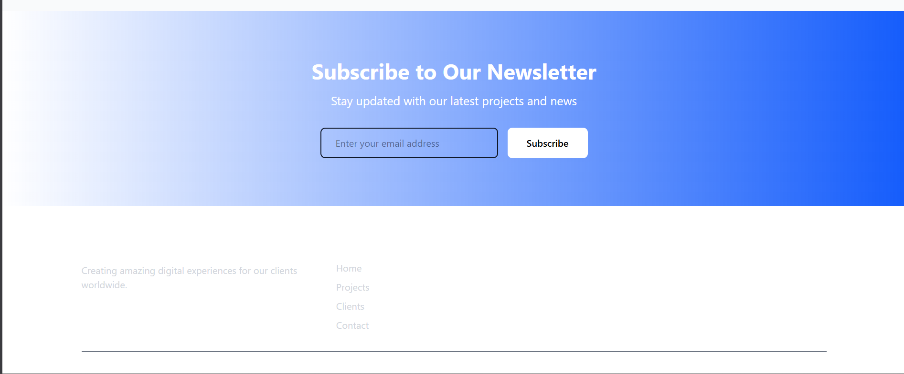

## 🛠️ Tech Stack

### Frontend
- React 18
- Vite
- React Router DOM
- Tailwind CSS
- Axios
- React Icons
- React Toastify

### Backend
- Node.js
- Express.js
- MongoDB with Mongoose
- Multer (file upload)
- Sharp (image processing)
- Express Validator
- CORS

## 📁 Project Structure

```
fullstack-project/
├── backend/
│   ├── config/
│   │   └── db.js                 # MongoDB connection
│   ├── middleware/
│   │   └── upload.js             # Multer & Sharp image processing
│   ├── models/
│   │   ├── Project.js            # Project schema
│   │   ├── Client.js             # Client schema
│   │   ├── Contact.js            # Contact form schema
│   │   └── Newsletter.js         # Newsletter schema
│   ├── routes/
│   │   ├── projects.js           # Project routes
│   │   ├── clients.js            # Client routes
│   │   ├── contacts.js           # Contact routes
│   │   └── newsletters.js        # Newsletter routes
│   ├── uploads/                  # Uploaded images directory
│   ├── .env.example             # Environment variables template
│   ├── .gitignore
│   ├── package.json
│   └── server.js                 # Express server entry point
│
└── frontend/
    ├── public/
    ├── src/
    │   ├── components/
    │   │   ├── admin/
    │   │   │   └── AdminLayout.jsx    # Admin panel layout
    │   │   ├── Header.jsx             # Landing page header
    │   │   ├── Hero.jsx               # Hero section
    │   │   ├── Projects.jsx           # Projects section
    │   │   ├── Clients.jsx            # Clients section
    │   │   ├── ContactForm.jsx        # Contact form
    │   │   ├── Newsletter.jsx         # Newsletter section
    │   │   └── Footer.jsx             # Footer
    │   ├── pages/
    │   │   ├── admin/
    │   │   │   ├── AdminProjects.jsx  # Projects management
    │   │   │   ├── AdminClients.jsx   # Clients management
    │   │   │   ├── AdminContacts.jsx  # Contact viewer
    │   │   │   └── AdminNewsletters.jsx # Newsletter management
    │   │   └── LandingPage.jsx        # Main landing page
    │   ├── services/
    │   │   └── api.js                 # API service layer
    │   ├── App.jsx                    # Main app component
    │   ├── main.jsx                   # React entry point
    │   └── index.css                  # Global styles
    ├── .env.example
    ├── .gitignore
    ├── index.html
    ├── package.json
    ├── postcss.config.js
    ├── tailwind.config.js
    └── vite.config.js
```
## 📸 Screenshots

### Landing Page - Hero Section

*Modern, eye-catching hero section with gradient background and call-to-action*

### Contact Form

*Professional contact form with full validation*

### Newsletter Subscription

*Newsletter subscription with elegant design*

## 🚀 Features

### Landing Page
- **Hero Section**: Eye-catching hero banner with call-to-action
- **Our Projects Section**: Dynamic project showcase fetched from backend
  - Project image (cropped to 450x350)
  - Project name and description
  - Read More button (UI only)
- **Happy Clients Section**: Client testimonials
  - Client image, name, designation, and testimonial
- **Contact Form**: User contact submission
  - Full Name, Email, Mobile Number, City fields
  - Form validation
  - Data sent to backend
- **Newsletter Subscription**: Email subscription feature
  - Email validation
  - Duplicate check

### Admin Panel
- **Project Management**: CRUD operations for projects
  - Add/Edit/Delete projects
  - Image upload with automatic cropping (450x350)
  - Form validation
- **Client Management**: CRUD operations for clients
  - Add/Edit/Delete client testimonials
  - Image upload with cropping
  - Designation management
- **Contact Form Viewer**: View all contact submissions
  - Display full details
  - Delete functionality
  - Timestamp tracking
- **Newsletter Subscribers**: Manage email subscriptions
  - View all subscribers
  - Export email list
  - Delete subscriptions

### Additional Features
- **Image Cropping**: All uploaded images are automatically cropped to 450x350 ratio using Sharp
- **Responsive Design**: Mobile-first approach with Tailwind CSS
- **Toast Notifications**: User feedback for all actions
- **Form Validation**: Client and server-side validation
- **Clean UI/UX**: Modern, intuitive interface